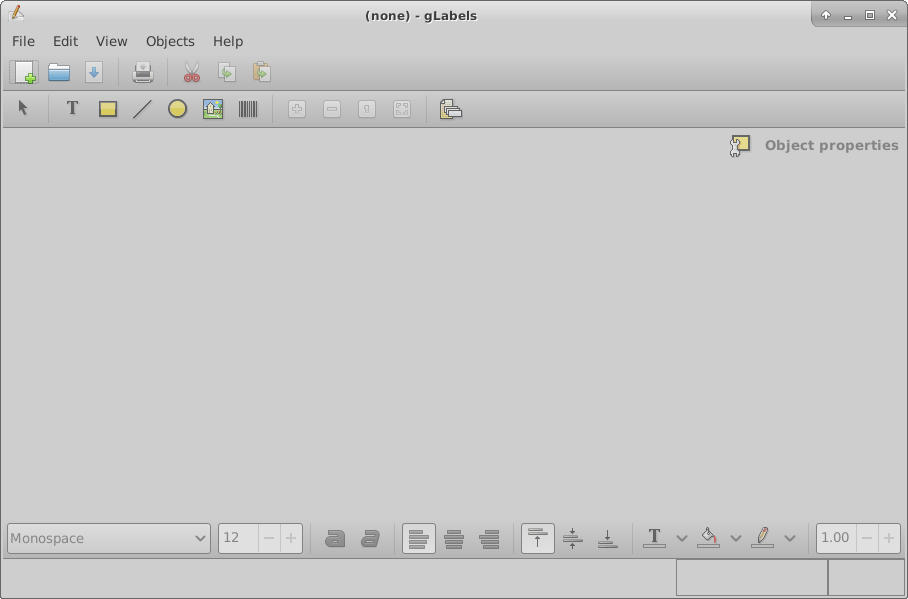
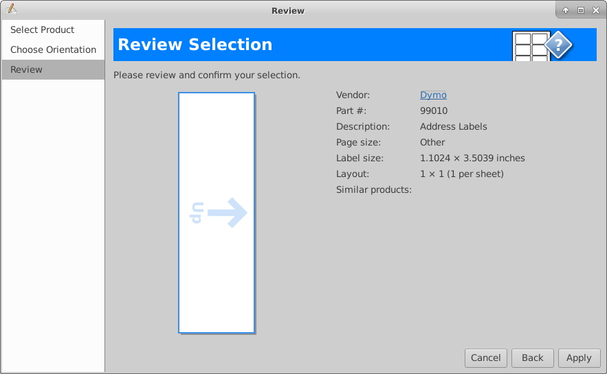
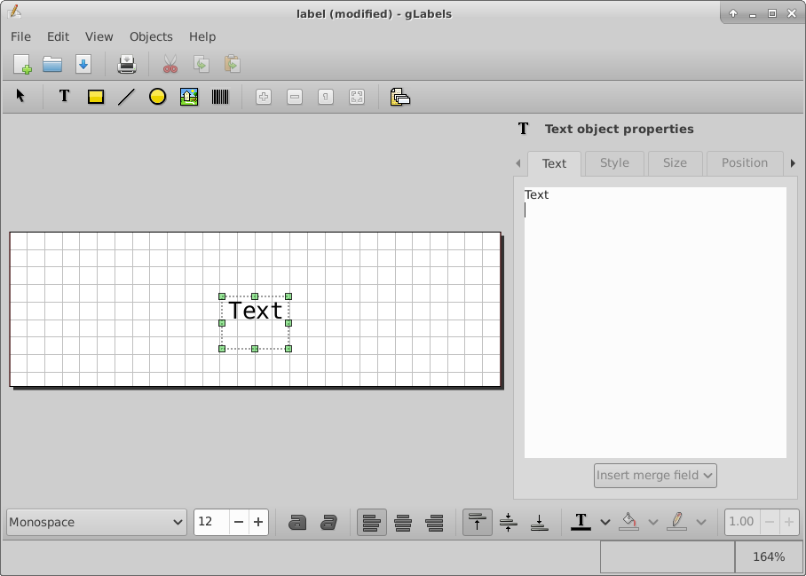

# glabels

```
sudo apt install glabels
```




New > 

```
Dymo 99010: Address Labels
1.1024 x 3.5039
1 x 1(1 per sheet)
```




Save as > label.glabels




file is gibberish


```
cat label.glabels
```

->

```
�S�n�0
         ��+��qR,C�b@�]R�r���ʒ!ɍ���$�iV�0_�Gz�����o$yGc�VMV�>�.(���yנr�w)��ڹ�+c�X^iS�Xa��3zX�?a�JpH.T�ѧ�є�`\Fw;�pJ���}q5J��pu`N�:}��EU��t���nR�܈�E�ߊ ��EDV���H��+m��F����؀���k�s��H���S��]���s��u8���LA���]6`*�&B�uaН#��Ԕ�!��Ϸ·��KZ1�˚'c�F��a��"z������6�A}2�Ǝ-K���u�l�DVO�W���i��I[=���:Q��#���w����;����>����� -���B��z
                                  ��܌h�ͬ_-(�k��O�<~eII��;��ٟ�Ҷ����z���u��O�:f�
���7iR(<�K�����ɻ�g���Φ�������ʞ}���?-����
```

file is zipped

```
cat label.glabels | gunzip
```
->
```
<?xml version="1.0"?>
<Glabels-document xmlns="http://glabels.org/xmlns/3.0/">
  <Template brand="Dymo" part="99010" size="Other" width="1.10236in" height="3.50394in" description="Address Labels">
    <Meta category="label"/>
    <Meta category="mail"/>
    <Label-rectangle id="0" width="1.10236in" height="3.50394in" round="0in" x_waste="0in" y_waste="0in">
      <Markup-margin size="0in"/>
      <Layout nx="1" ny="1" x0="0in" y0="0in" dx="1.10236in" dy="3.50394in"/>
    </Label-rectangle>
  </Template>
  <Objects id="0" rotate="True">
    <Object-text x="1.51586in" y="0.460903in" w="0in" h="0in" justify="Left" valign="Top" auto_shrink="False" a0="1" a1="0" a2="0" a3="1" a4="0" a5="0">
      <Span color="0x000000ff" font_family="Monospace" font_size="12" font_weight="Regular" font_italic="False" line_spacing="1">Text</Span>
    </Object-text>
  </Objects>
  <Data/>
</Glabels-document>

```

open file

```
glabels-3 label.glabels
```

convert xml to pdf
```
glabels-3-batch labels.glabels
```

view pdf, default name output.pdf
```
atril output.pdf
```

get printer name
```
lpstat -s
```

->
```
LabelWriter-450
```

print pdf file
```
lpr -P LabelWriter-450 output.pdf
```