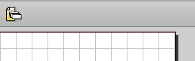
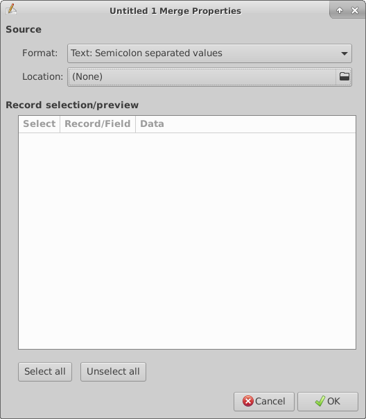
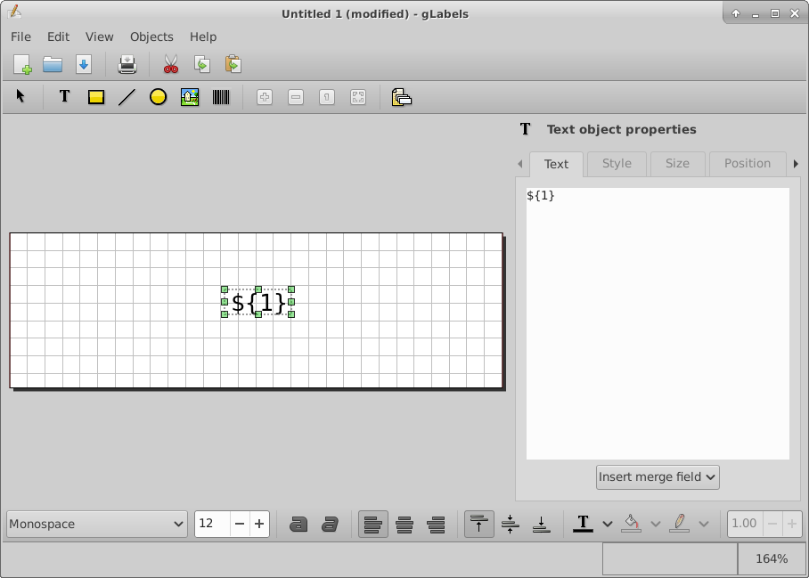
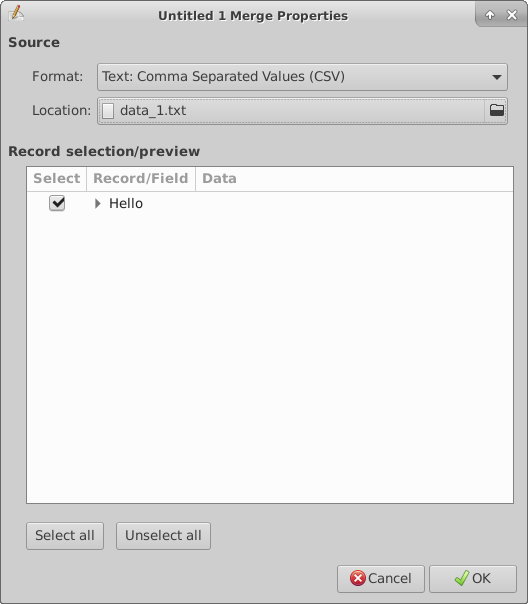
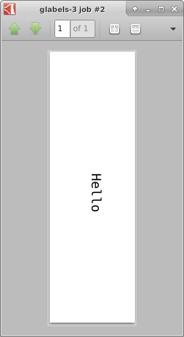
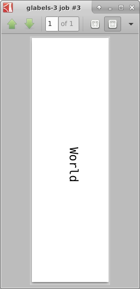
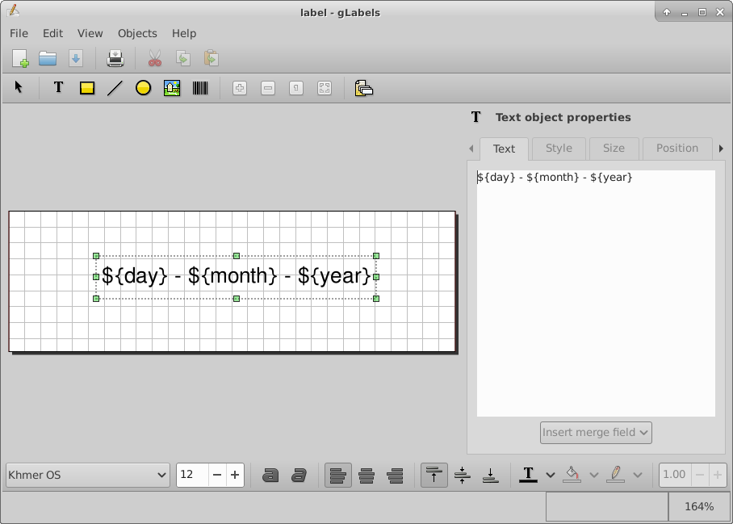
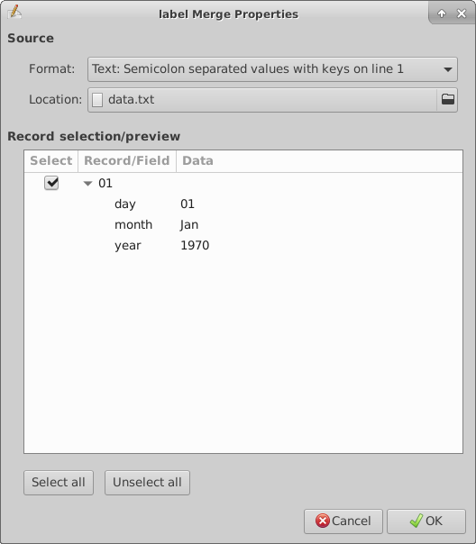
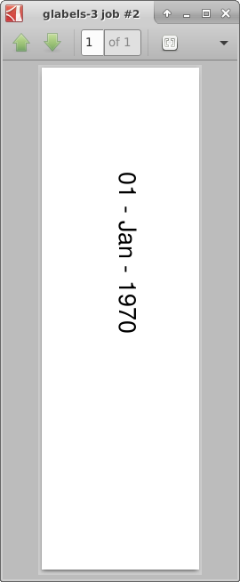
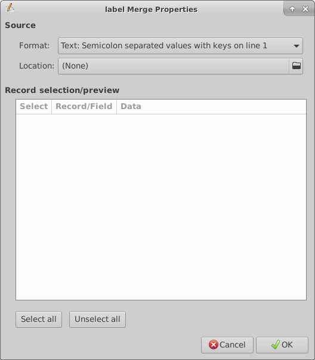

# create label from data


```
glabels-3 &
```

edit merge properties




get text from file, cancel




```
echo "Hello" > data_1.txt
echo "World" > data_2.txt
```




Print > Print Preview

label from file 1






label from file 2




```
echo -e 'day;month;year\r\n01;Jan;1970' > data.txt
```


create glabel file

```
${day} - ${month} - ${year}
```

glab






extract data from command line

set location to None, save, close



```
echo -e 'day;month;year\r\n31;Dec;3000' > data.txt
glabels-3-batch -i data.txt -o date_label.pdf label.glabels
atril date_label.pdf

```
