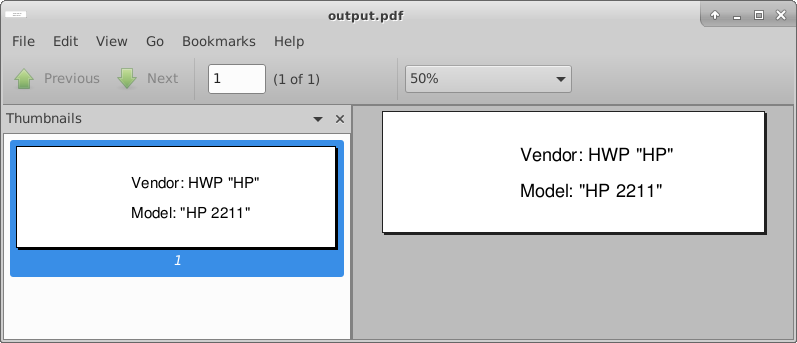

# bash scripting

```
glabels-3 &
```


get specific data using grep
```
hwinfo --monitor | grep -E -m2 "Vendor: .*|Model: "
```

->
```
Model: "HP 2211"
Vendor: HWP "HP"
```

all together
```bash
model=$(hwinfo --monitor | grep -m1 "Vendor: ")
vendor=$(hwinfo --monitor | grep -m1 "Model: ")
keys="Vendor;Model;\n"
echo -e $keys $model ';' $vendor > data.txt
glabels-3-batch -i data.txt -o output.pdf label.glabels
atril output.pdf &

```

